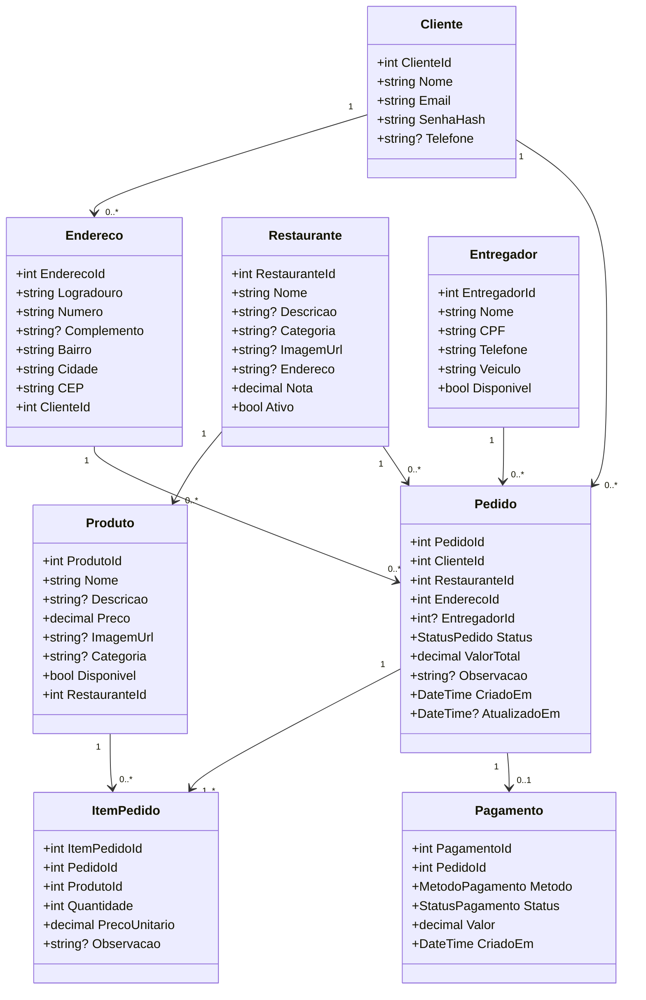

# Entrega Banco de Dados - DER e Diagrama de Classes

## 1) DER (Modelo Conceitual)

```mermaid
erDiagram
    CLIENTES ||--o{ ENDERECOS : possui
    CLIENTES ||--o{ PEDIDOS : realiza
    RESTAURANTES ||--o{ PRODUTOS : oferece
    RESTAURANTES ||--o{ PEDIDOS : recebe
    ENDERECOS ||--o{ PEDIDOS : entrega_em
    ENTREGADORES ||--o{ PEDIDOS : entrega
    PEDIDOS ||--|{ ITENS_PEDIDO : contem
    PRODUTOS ||--o{ ITENS_PEDIDO : compoe
    PEDIDOS ||--|| PAGAMENTOS : gera

    CLIENTES {
        int cliente_id PK
        string nome
        string email UK
        string senha_hash
        string telefone
        bool is_admin
    }

    ENDERECOS {
        int endereco_id PK
        string logradouro
        string numero
        string complemento
        string bairro
        string cidade
        string cep
        int cliente_id FK
    }

    RESTAURANTES {
        int restaurante_id PK
        string nome
        string descricao
        string categoria
        string imagem_url
        string endereco
        decimal nota
        bool ativo
    }

    PRODUTOS {
        int produto_id PK
        string nome
        string descricao
        decimal preco
        string imagem_url
        string categoria
        bool disponivel
        int restaurante_id FK
    }

    ENTREGADORES {
        int entregador_id PK
        string nome
        string cpf UK
        string telefone
        string veiculo
        bool disponivel
    }

    PEDIDOS {
        int pedido_id PK
        int cliente_id FK
        int restaurante_id FK
        int endereco_id FK
        int entregador_id FK
        int status
        decimal valor_total
        string observacao
        datetime criado_em
        datetime atualizado_em
    }

    ITENS_PEDIDO {
        int item_pedido_id PK
        int pedido_id FK
        int produto_id FK
        int quantidade
        decimal preco_unitario
        string observacao
    }

    PAGAMENTOS {
        int pagamento_id PK
        int pedido_id FK UK
        int metodo
        int status
        decimal valor
        datetime criado_em
    }
```

## 2) Diagrama de Classes (Modelo de Dominio)


